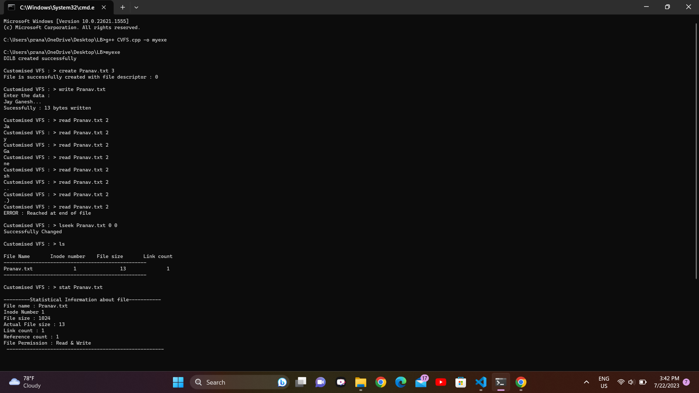
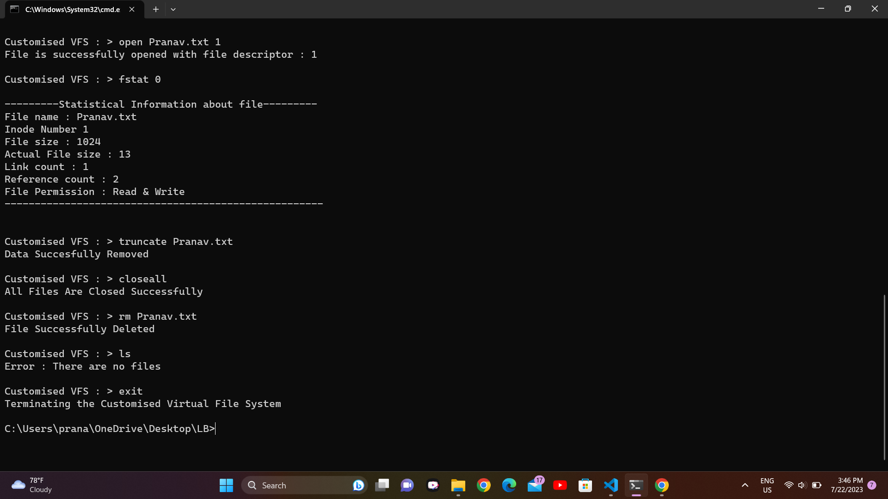

<div align="center">
    <h1>License & Copyright</h1>
    <h1>CUSTOMIZED VIRTUAL FILE SYSTEM</h1>
    <!--<i>A collective list of free APIs for use in software and web development</i>-->
</div>

@@ -14,6 +14,7 @@

  [](https://github.com/PRASAD-DANGARE/Virtual_File_System/blob/main/LICENSE)
  
  
  
  
  
@@ -34,27 +35,64 @@


# CUSTOMIZED VIRTUAL FILE SYSTEM
#

### PLATFORM REQUIRED :   
```Windows Platform Or Linux Distributions.```
```
Windows Platform Or Linux Distributions.
```
### ARCHITECTURAL REQUIREMENT :  
```INTEL 32 Bit Processor Or Higher.```
```
INTEL 32 Bit Processor Or Higher.
```
### USER INTERFACE :             
```Command Line Interface.```
```
Command Line Interface.
```
### TECHNOLOGY USED : 
```System Programming Using C.```
```
System Programming Using C.
```
#


<div align="center">
    <h1>ABOUT CUSTOMIZED VIRTUAL FILE SYSTEM</h1>
</div>


#

```
1) In This Project I Emulate All Data Structures Which Are Used By Operating System To Manage File System Oriented Tasks.
2) As The Name Suggests Its Virtual Because I Maintain All The Records In Primary Storage (RAM).
# About Customized Virtual File System
3) In This Project I Create All Data Structures Which Required For File Subsystems As : FT, UAREA, UFDT, SB, DILB, DB etc.
```1) In This Project I Emulate All Data Structures Which Are Used By Operating System To Manage File System Oriented Tasks.```
4) I Provide All Implementations Of Necessary System Calls And Commands Of File subsystem As : Open, Close, Read, Write, Lseek, Create, RM, LS, Stat, Fstat etc.
```2) As The Name Suggests Its Virtual Because I Maintain All The Records In Primary Storage (RAM).```
5) While Creating This Project All Above Functionality I Use Our Own Data Structures By Referring Algorithms of UNIX Operating System.
6) By Using This Project I Can Get Overview Of UFS (UNIX File System) On Any Platform.
```

#


<div align="center">
    <h1>DEMO OUTPUT</h1>
</div>


```3) In This Project I Create All Data Structures Which Required For File Subsystems As : FT, UAREA, UFDT, SB, DILB, DB etc.```
#

```4) I Provide All Implementations Of Necessary System Calls And Commands Of File subsystem As : Open, Close, Read, Write, Lseek, Create, RM, LS, Stat, Fstat etc.```


```5) While Creating This Project All Above Functionality I Use Our Own Data Structures By Referring Algorithms of UNIX Operating System.```
#

```6) By Using This Project I Can Get Overview Of UFS (UNIX File System) On Any Platform.```

